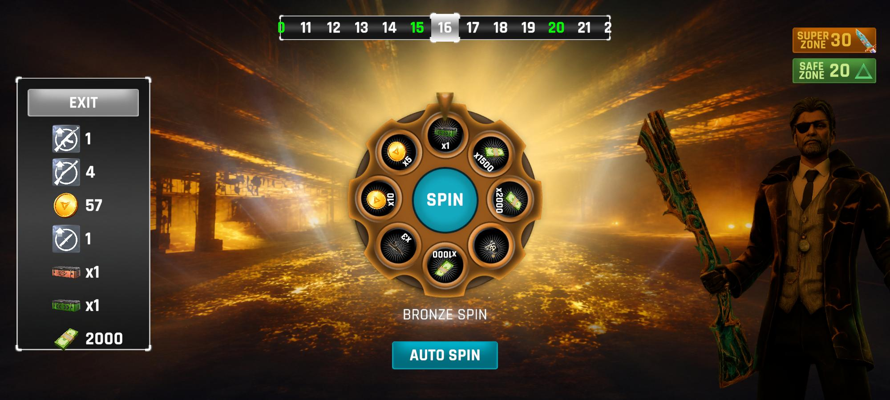
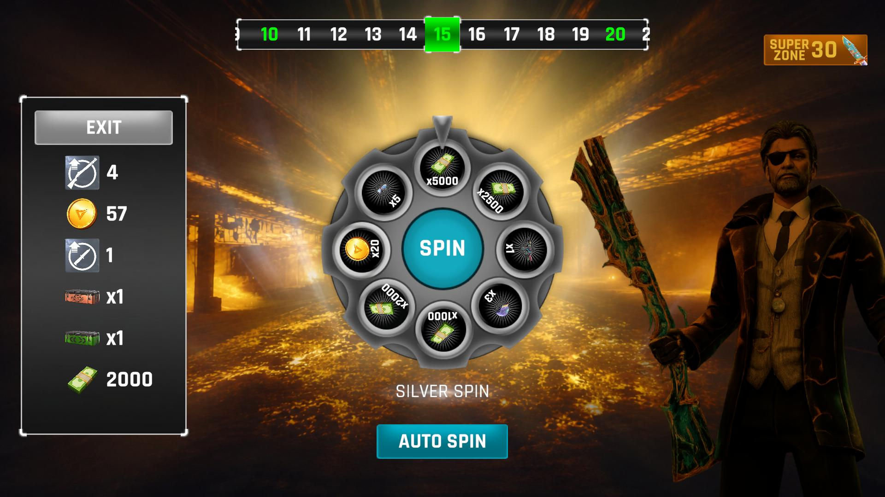
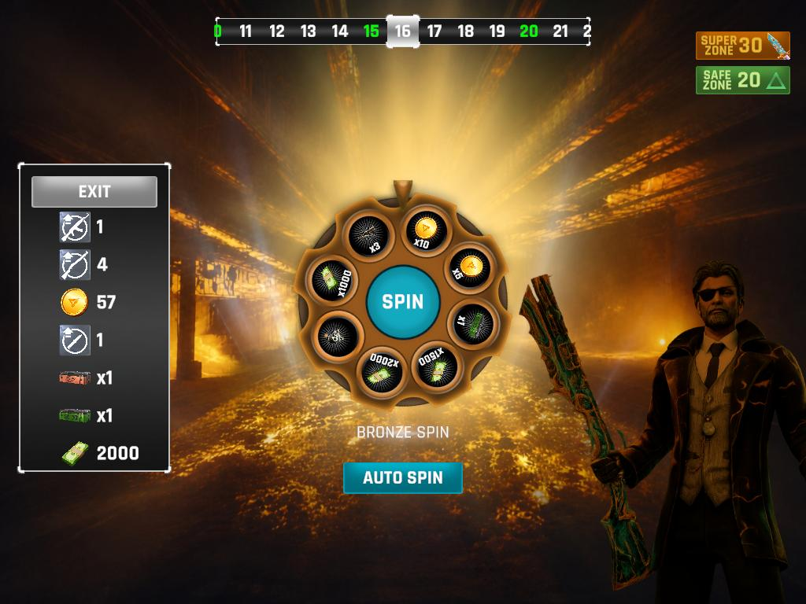
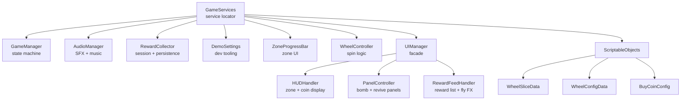
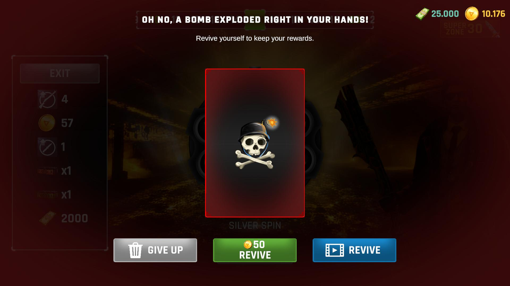
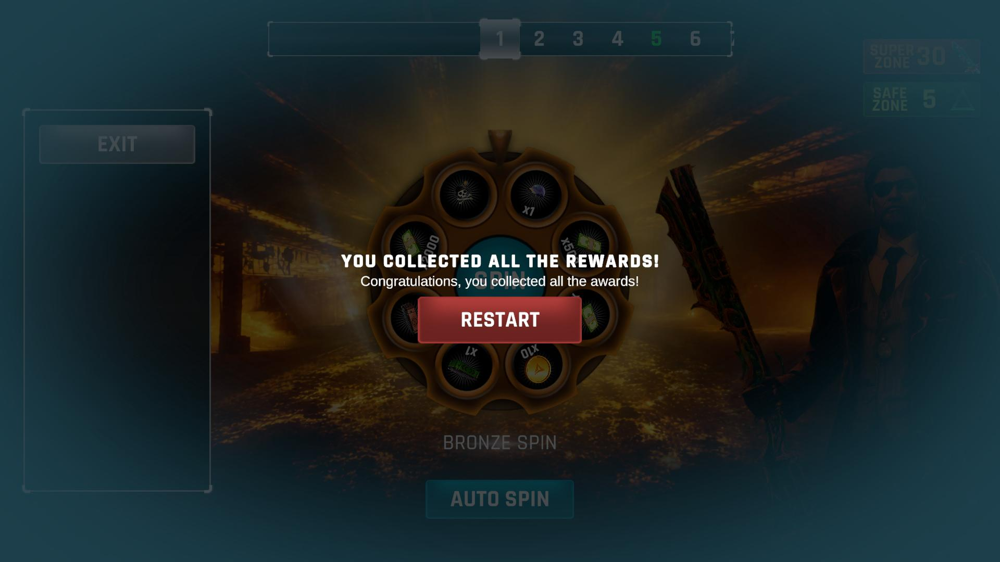
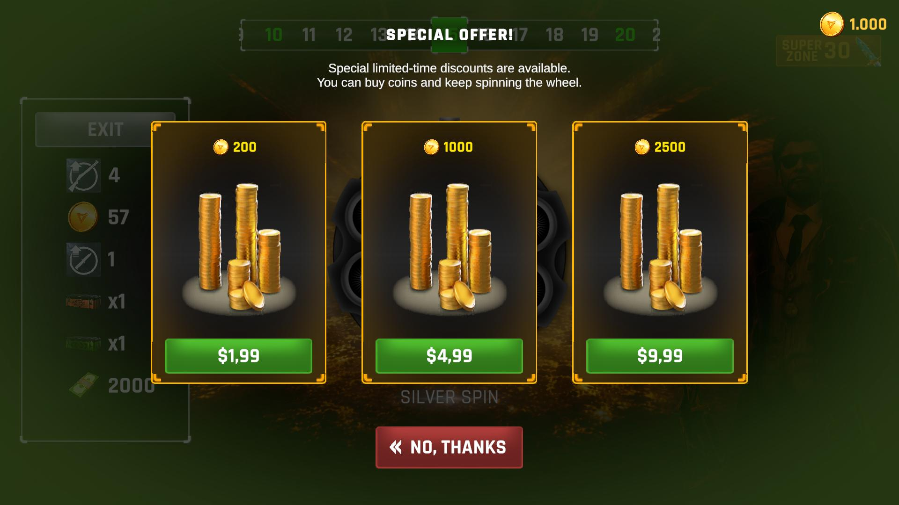

# Wheel of Fortune
### Vertigo Games - Game Developer Case

---

## Design Approach

I played the Card Game mode in Critical Strike for a while to understand how the UI looks and feels. I tried to match the fonts, colors, and animations as close as possible to Critical Strike's style. I also made sure to use all the assets from the demo content pack.  
On the code side, I used a service locator to keep the managers separate from each other. All animations run through DOTween, no coroutines. The wheel content is data-driven with ScriptableObjects, and I built custom EditorGUI tools so things like slice data and player settings can be changed directly in the Unity Editor without touching any code.

---

## Gameplay Video

**[Watch Gameplay](https://youtu.be/NrDbk1rdM7E)**
*Recorded at 16:9*

---

## Screenshots

| 20:9 | 16:9 | 4:3 |
|:---:|:---:|:---:|
|  |  |  |

---

## How It Works

At each zone the player spins a wheel containing reward slices and a bomb. Landing on a reward adds it to the session and advances to the next zone. Landing on the bomb ends the run all session earnings are lost unless the player revives. Every 5th zone is a bomb-free Silver zone; zones 30 and 60 are Golden Super zones. The player may cash out and keep their earnings at any Silver or Super zone before spinning.

| Zone | Type | Wheel | Bomb |
|---|---|---|---|
| 1–4, 6–9… | Normal | Bronze | Yes |
| 5, 10, 15… | Safe | Silver | No |
| 30 | Super | Gold | No |
| 60 | Final | Gold | No |

---

## Architecture

### Managers

| Class | Responsibility |
|---|---|
| `GameServices` | Central service locator - `Register<T>()` / `Get<T>()` / `TryGet<T>()` |
| `GameManager` | State machine: Idle / Spinning / Result / Bomb / RewardComplete |
| `AudioManager` | Dictionary-keyed SFX bank, per-wheel-tier looping background music |
| `RewardCollector` | Session reward tracking, PlayerPrefs persistence on cash-out |
| `DemoSettings` | Dev tooling - configurable starting values, PlayerPrefs reset |
| `ZoneProgressBar` | Scrollable zone indicator, color-coded tier fills, animated transitions |

### Controllers

| Class | Responsibility |
|---|---|
| `WheelController` | Spin physics, slice randomization, idle rotation, auto-spin, result flow |

### UI Handlers

| Class | Responsibility |
|---|---|
| `UIManager` | Facade - holds serialized UI references, delegates to handlers, button wiring |
| `HUDHandler` | Zone info, coin display, exit/auto-spin button state, character idle animation |
| `PanelController` | Bomb / Game Over / Reward Complete / Buy Coin panel animations and flow |
| `RewardFeedHandler` | Reward list item creation, coin fly and collect icon effects, smooth scroll |

### ScriptableObjects

| Class | Responsibility |
|---|---|
| `WheelSliceData` | Icon, display name, reward amount, bomb flag |
| `WheelConfigData` | Reward pool array, wheel visuals, hasBomb flag, background music clip |
| `BuyCoinConfig` | Three-tier coin purchase configuration |

---

## Technical Details

**Code Quality**
- SOLID principles applied throughout - each manager has a single clear responsibility; wheel and reward configurations are open for extension without modifying existing classes
- No coroutine-based animation anywhere; all motion handled exclusively through DOTween
- All button references resolved automatically via `OnValidate` - no Unity Editor onClick or event references

**UI & Layout**
- Canvas Scaler set to Expand mode, anchors and pivots verified across 20:9, 16:9, and 4:3
- TextMeshPro used for all text elements
- Sliced Sprites on all Image components - no stretching at any resolution
- `RaycastTarget` and `Maskable` disabled on all non-interactive images
- Animator components placed on dedicated child transforms, never on root
- Dynamic UI elements follow `_value` suffix convention; hierarchy naming follows root-to-specific pattern (e.g. `ui_image_spin_silver`)

**Data**
- `RewardCollector` holds session state; flushed to `PlayerPrefs` on cash-out, discarded on give-up
- `WheelSliceData` and `WheelConfigData` ScriptableObjects allow full wheel content editing from the Inspector
- `DemoSettingsEditor` provides a custom inspector with Clear and Reset tools for testing

**Rendering**
- Sprite Atlas for draw call batching
- Instance materials used for per-object visual effects (e.g. bomb/fade)

---

## Animations

| Effect | Implementation |
|---|---|
| Wheel spin | OutCubic ease, 5–9 extra full rotations, overshoot and bounce-back on result |
| Collect fly | Single icon travels from wheel center to reward list entry with rotation |
| Coin revive | 5 coins spawn at button, scatter randomly, converge to coin icon with progressive shrink; target scales to 1.3× on arrival |
| Reward stack | New items scale and fade in; existing items pulse and count up with per-increment tick sound |
| Bomb | Screen shake, bomb icon scale and fade |
| Character idle | Scale breathing 1.0 ↔ 1.03 on a 2-second loop |
| Zone progress | Fill bar advances, text crossfades, content scrolls on zone change |

---

## Audio

`AudioManager` maintains a dictionary-keyed SFX bank and separate looping music channels. Background music switches automatically when the wheel tier changes. SFX events: revolver spin, coin collect, item reward, game over, count-up tick.

---

## Download

**[Releases →](../../releases/latest)**

---

## UI Panels

| Game Over | Reward Complete | Special Offer |
|:---:|:---:|:---:|
|  |  |  |

---

## Stack

Unity 2021 LTS — DOTween — TextMeshPro — ScriptableObjects — Sprite Atlas — PlayerPrefs
